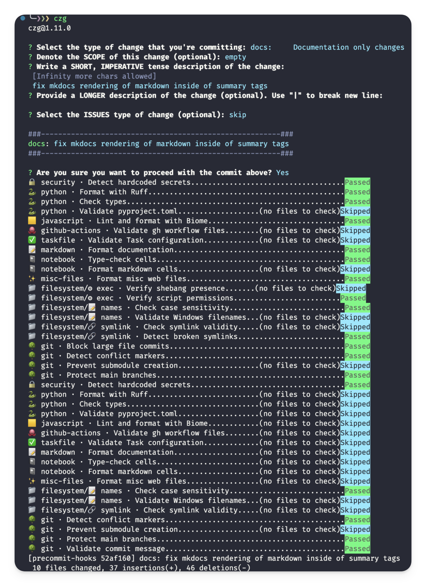

# Pre-commit Hooks Collection


## What are Git hooks?

[Git hooks](https://git-scm.com/book/en/v2/Customizing-Git-Git-Hooks) are scripts that run automatically at some stage in the git-lifecycle. Most commonly, pre-commit hooks are used, running before a commit goes through. They act as a first line of defense for code quality by:

- Catching formatting issues
- Finding potential security risks
- Validating configurations
- Running quick tests
- Enforcing team standards

## Why use pre-commit?

[Pre-commit](https://pre-commit.com/) is a framework that makes these Git hooks:

1. **Easy to share** - Hooks are defined in a single YAML file
1. **Language-agnostic** - Works with Python, JavaScript, and more
1. **Fast** - Only runs on staged files and are much quicker than CI/CD
1. **Forgettable** - Team members don't need to memorize QA tools; hooks run automatically
1. **Extendable** - Large ecosystem of ready-to-use hooks

Pre-commit helps maintain code quality without slowing down development. While CI/CD pipelines might take minutes to run, pre-commit hooks provide instant feedback right when you commit. Despite the name, Pre-commit can install hooks at any stage (ex: Use a pre-push hook as a slightly more time-intensive pre-commit and push multiple commits at once.)

**Common Use Cases**

Pre-commit can be as strict as you want depending on your project's quality-time tradeoff. Here are cases where commit-level checks make more sense than pull-request level:

1. Linting/formatting code and data files
1. Re-building code or documentation
1. Making database migrations
1. Preventing secrets or large files from being committed
1. Requiring commit messages to follow a standard (Like [Commitizen](https://commitizen-tools.github.io/commitizen/))
1. Running fast tests

<details markdown="1">
<summary>
Alternatives (Husky)
</summary>
[Husky](https://typicode.github.io/husky/) is an alternative to pre-commit that's primarily designed for the NodeJS ecosystem. To my knowledge, while both tools handle Git hooks effectively, pre-commit offers broader multi-language support and has become standard in the Python community.
</details>

## Installation

1. The repository comes with a `.pre-commit-config.yaml` file already configured
1. Install the hooks with:

```bash
pre-commit install
```

You'll see hooks run automatically on every commit:


**Useful Commands:**

```bash
# Update hooks to their latest versions
pre-commit autoupdate

# Reinstall hooks (needed after config changes)
pre-commit install

# Test hooks without committing
pre-commit run --all-files
```

______________________________________________________________________

## Hooks

This collection prioritizes best-in-class tools without redundancy. Rather than using multiple overlapping tools, we've selected the most effective option for each task. For example:

- Python linting uses only Ruff instead of multiple separate linters
- JSON/YAML/TOML validation uses specialized schema validators
- Security scanning uses a single comprehensive tool

<!-- TODO: List pre-commit dependency updater. -->

## 01 🔒 Security

[GitLeaks](https://github.com/gitleaks/gitleaks) is a fast, lightweight scanner that prevents secrets (passwords, API keys, tokens) from being committed to your repository.

```yaml
- repo: https://github.com/gitleaks/gitleaks
  rev: v8.22.1
  hooks:
    - id: gitleaks
      name: "🔒 security · Detect hardcoded secrets"
```

<details markdown="1">
<summary>
Alternatives to GitLeaks (TruffleHog)
</summary>
[TruffleHog](https://github.com/trufflesecurity/trufflehog) offers more comprehensive and continuous security scanning across a variety of platforms (not just files). However, it requires more setup time and resources than GitLeaks. Consider TruffleHog for expansive projects with strict security requirements.
</details>

<!-- TODO: Read this, https://kislyuk.github.io/argcomplete/ -->

<!-- TODO: Note that Pre-Commit hooks can result in a security hazard. -->

## 02 🔍 Code Quality

This section covers tools for code formatting, linting, type checking, and schema validation across different languages and file types. Best-in-class tools were chosen, avoiding redundant functionality. I opted for remote hook downloads over local commands to make the file more portable and self-updating.

### 🐍 python

[Ruff](https://docs.astral.sh/ruff/) is a fast, comprehensive Python formatter and linter that replaces multiple traditional tools (Black, Flake8, isort, pyupgrade, bandit, pydoclint, mccabe complexity, and more.) While it's not yet at 100% parity with all these tools, its speed and broad coverage make it an excellent choice as this project's only Python linter/formatter:

```yaml
- repo: https://github.com/astral-sh/ruff-pre-commit
  rev: v0.8.6
  hooks:
    - id: ruff-format
      name: "🐍 python · Format with Ruff"
```

<details markdown="1">
<summary>
Alternatives to Ruff (Too Many to Name)
</summary>


Before Ruff, a typical Python project might use several separate tools:

- [Black](https://black.readthedocs.io/) for code formatting
- [isort](https://pycqa.github.io/isort/) for import sorting
- [Flake8](https://flake8.pycqa.org/) for style enforcement
- [Pylint](https://pylint.readthedocs.io/) for code analysis
- [Bandit](https://bandit.readthedocs.io/) for security checks
- [pyupgrade](https://github.com/asottile/pyupgrade) for modernizing syntax
- [pydocstyle](https://www.pydocstyle.org/) for docstring checking
- [Many more... 😵‍💫](https://docs.astral.sh/ruff/faq/#which-tools-does-ruff-replace)

While these tools are battle-tested and highly configurable, using Ruff provides several advantages:

1. **Speed**: Ruff is 10-100x faster as it's written in Rust
1. **Simplicity**: Single configuration file and consistent interface
1. **Active Development**: Rapidly adding features and reaching feature parity
1. **Modern Defaults**: Better handling of new Python features

Consider using individual tools if you need specific features not yet supported by Ruff or have complex existing configurations you need to maintain.

</details>

<br/>

While Ruff does many things, type checking it does not... [yet](https://github.com/astral-sh/ruff/issues/3893).

Microsoft's [Pyright](https://microsoft.github.io/pyright/) handles Python type checking:

```yaml
  - repo: https://github.com/RobertCraigie/pyright-python
    rev: v1.1.391
    hooks:
      - id: pyright
        name: "🐍 python · Check types"
```

_Note: Community supported pre-commit hook, endorsed by microsoft_

<details markdown="1">
<summary>
Alternatives to Pyright (MyPy)
</summary>
Microsoft's [Pyright](https://microsoft.github.io/pyright/) is a [faster and more featureful](https://github.com/microsoft/pyright/blob/main/docs/mypy-comparison.md) alternative to [MyPy](https://mypy-lang.org/), but MyPy is the original type checker.
</details>

<br/>

<!-- TODO: Add vulture https://github.com/jendrikseipp/vulture -->

### 🟨 JavaScript & Web Tools

[Biome](https://biomejs.dev/internals/language-support/) is a modern, fast formatter and linter for JS/TS ecosystems (JS[X], TS[X], JSON[C], CSS, GraphQL). It provides better defaults than ESLint and comes with a helpful [VSCode Extension](https://marketplace.visualstudio.com/items?itemName=biomejs.biome):

```yaml
- repo: https://github.com/biomejs/pre-commit
  rev: "v0.6.1"
  hooks:
    - id: biome-ci
      name: "🟨 javascript · Lint and format with Biome"
      additional_dependencies: ["@biomejs/biome@1.9.4"]
```

<details markdown="1">
<summary>
Alternatives to Biome (ESLint & Prettier)
</summary>
[ESLint](https://eslint.org/) and [Prettier](https://prettier.io/) are more established alternatives with broader plugin ecosystems. While Prettier supports many file types, it can be notably slow, sometimes produces unexpected formatting, and sometimes breaks code (which I find annoying). Since this is primarily a Python-focused project template and Biome handles our JavaScript needs efficiently, we prefer it over the traditional ESLint/Prettier setup. Consider ESLint and Prettier if you need plugins, support for specific JS frameworks, or formatting for languages unsupported elsewhere. (More linters [here](https://github.com/caramelomartins/awesome-linters) as well)
</details>

### ✅ Data & Config Validation

[check-jsonschema](https://check-jsonschema.readthedocs.io/) validates various configuration files using [JSON Schema](https://json-schema.org/specification). It supports JSON, YAML, and TOML files, and includes specialized validators like the [TaskFile](https://taskfile.dev/) and [GitHub Actions](https://github.com/features/actions) checker:

```yaml
- repo: https://github.com/python-jsonschema/check-jsonschema
  rev: 0.30.0
  hooks:
    - id: check-github-workflows
      name: "🐙 github-actions · Validate gh workflow files"
      args: ["--verbose"]
    - id: check-taskfile
      name: "✅ taskfile · Validate Task configuration"
```

_Additional json schema available on the [Schema Store](https://json.schemastore.org/pyproject.json)_

[validate-pyproject](https://validate-pyproject.readthedocs.io/) specifically handles pyproject.toml validation. In the future, I may have check-jsonschema do this as well.

```yaml
- repo: https://github.com/abravalheri/validate-pyproject
  rev: v0.23
  hooks:
    - id: validate-pyproject
      name: "🐍 python · Validate pyproject.toml"
      additional_dependencies: ["validate-pyproject-schema-store[all]"]
```

<!-- Possibly worth just building? -->

### 📝 Markdown

[mdformat](https://mdformat.readthedocs.io/) for Markdown formatting with additional plugins for GitHub-Flavored Markdown, Ruff-style code formatting, and frontmatter support:

```yaml
- repo: https://github.com/hukkin/mdformat
  rev: 0.7.21
  hooks:
    - id: mdformat
      name: "📝 markdown · Format markdown"
      additional_dependencies:
        - mdformat-gfm          # GitHub-Flavored Markdown support
        - mdformat-ruff         # Python code formatting
        - mdformat-frontmatter  # YAML frontmatter support
        - ruff                  # Required for mdformat-ruff
```

[Markdownlint](https://github.com/markdownlint/markdownlint/tree/main) for Markdown linting.
They also have a [VSCode plugin](https://marketplace.visualstudio.com/items?itemName=DavidAnson.vscode-markdownlint) that will display any issues in-editor.

```yaml
- repo: https://github.com/markdownlint/markdownlint
    rev: v0.12.0
    hooks:
      - id: markdownlint
        name: "📝 markdown · Lint markdown"
```

### 📓 Notebooks

[nbQA](https://nbqa.readthedocs.io/) for Jupyter notebook quality assurance, allowing us to use our standard Python tools on notebooks:

```yaml
- repo: https://github.com/nbQA-dev/nbQA
  rev: 1.9.1
  hooks:
    - id: nbqa-mypy
      name: "📓 notebook · Type-check cells"
    - id: nbqa
      entry: nbqa mdformat
      name: "📓 notebook · Format markdown cells"
      args: ["--nbqa-md"]
      types: [jupyter]
      additional_dependencies:  # Same dependencies as mdformat
        - mdformat
        - mdformat-gfm
        - mdformat-ruff
        - mdformat-frontmatter
        - ruff
```

<details markdown="1">
<summary>
ruff supports notebooks by default
</summary>
[Ruff has built-in support for Jupyter Notebooks](https://docs.astral.sh/ruff/configuration/#jupyter-notebook-discovery), so this has been excluded from nbQA since it would be redundant. nbQA has `nbqa-ruff-format` and `nbqa-ruff-check` hooks, but these appear to be redundant.
</details>

### ✨ Additional File Types

[Prettier](https://prettier.io/) handles formatting for various file types not covered by other tools (HTML, CSS, YAML, etc.). While it can be slow and sometimes produces code-breaking formatting, it remains the standard for these file types:

```yaml
- repo: https://github.com/pre-commit/mirrors-prettier
  rev: v4.0.0-alpha.8
  hooks:
    - id: prettier
      name: "✨ misc-files · Format misc web files"
      types_or: [yaml, html, scss]
      additional_dependencies:
        - prettier@3.4.2
```

<details markdown="1">
<summary>
Future Improvements
</summary>

I might replace Prettier with more focused tools in the future (Perhaps [HTMLHint](https://htmlhint.com/) for HTML validation but it's hardly a linter.)

However, this would require managing multiple tools and dependencies, so I'm sticking with Prettier for now.

_My disatisfaction with prettier is humorously shared by pre-commit, as they [themselves no longer support the prettier hook](https://github.com/pre-commit/mirrors-prettier#archived) because "prettier made some changes that breaks plugins entirely"_

</details>

### 🛠️ Local Tools

For using tools without hooks, you can also run a local command:

```yaml
- repo: local
  hooks:
    - id: make-lint
      name: Run 'make lint'
      entry: make
      args: ["lint"]
      language: system
```

Note: If you're using [uv](https://docs.astral.sh/uv/), they [also have pre-commits](https://github.com/astral-sh/uv-pre-commit) available.

<!-- CZ git https://cz-git.qbb.sh/cli/why -->

## 03 📁 Filesystem

These hooks help maintain repository hygiene by preventing common file-related issues:

```yaml
- repo: https://github.com/pre-commit/pre-commit-hooks
  rev: v5.0.0
  hooks:
    - id: check-executables-have-shebangs
      name: "📁 filesystem/⚙️ exec · Verify shebang presence"
    - id: check-shebang-scripts-are-executable
      name: "📁 filesystem/⚙️ exec · Verify script permissions"
    - id: check-case-conflict
      name: "📁 filesystem/📝 names · Check case sensitivity"
    - id: check-illegal-windows-names
      name: "📁 filesystem/📝 names · Validate Windows filenames"
    - id: check-symlinks
      name: "📁 filesystem/🔗 symlink · Check symlink validity"
    - id: destroyed-symlinks
      name: "📁 filesystem/🔗 symlink · Detect broken symlinks"
    # ... More Below ...
```

- `check-added-large-files` - Prevents committing files larger than 8000KB ([Git Large File Storage (LFS)](https://git-lfs.com/) or [Data Version Control (DVC)](https://dvc.org/) should instead be used)
- `check-case-conflict` - Prevents issues on case-insensitive filesystems (Windows/MacOS)
- `check-symlinks` & `destroyed-symlinks` - Maintains symlink integrity
- `check-executables-have-shebangs` - Ensures scripts are properly configured
- `check-illegal-windows-names` - Check for files that cannot be created on Windows.

## 04 🌳 Git Quality

### Branch Protection

```yaml
- repo: https://github.com/pre-commit/pre-commit-hooks
  rev: v5.0.0
  hooks:
    # ... More Above ...
    - id: check-merge-conflict
      name: "🌳 git · Detect conflict markers"
    - id: forbid-new-submodules
      name: "🌳 git · Prevent submodule creation"
    - id: no-commit-to-branch
      name: "🌳 git · Protect main branches"
      args: ["--branch", "main", "--branch", "master"]
    - id: check-added-large-files
      name: "🌳 git · Block large file commits"
      args: ['--maxkb=1000']
      
```

- `forbid-new-submodules` - Prevent addition of new git submodules. (I'm mixed on this one since I think this is a confusing paradigm but don't know of better alternatives.)
- `check-merge-conflict` - Prevents committing unresolved merge conflicts
- `no-commit-to-branch` - Protects main branches from direct commits (GitHub branch protections are for enterprise members only (sad))

For the best experience:

1. Use `cz commit` instead of `git commit`
1. Consider [czg](https://cz-git.qbb.sh/) for a better implementation of the `cz` cli (I'm personally a fan of the AI generated commits it has.)

### 🗒️ Commit Message Standards

[Commitizen](https://commitizen.github.io/cz-cli/) enforces standardized commit messages that enable automatic changelog generation and semantic versioning

Additionally, I add [cz-conventional-gitmoji](https://github.com/ljnsn/cz-conventional-gitmoji), a third-party prompt template that combines the [gitmoji](https://gitmoji.dev/) and [conventional commit](https://www.conventionalcommits.org/en/v1.0.0/) standards. (More templates [here](https://commitizen-tools.github.io/commitizen/third-party-commitizen/))

```yaml
- repo: https://github.com/commitizen-tools/commitizen
  rev: v4.1.0
  hooks:
    - id: commitizen
      name: "🌳 git · Validate commit message"
      stages: [commit-msg]
```

<details markdown="1">
<summary>
Alternatives to Commitizen (Commitlint)
</summary>
[commitlint](https://github.com/conventional-changelog/commitlint) is a similar project to commitizen. Many articles claim that the difference between the two are that commitizen is more of a tool to generate these fancy commits while commitlint is meant to lint the commits. However, considering `cz check` is a thing, I'm confused what the difference is. The tools can be used together. Seems like commitizen has better python support than commitlint. Projects equally popular. More research to be done on the differences!
</details>
<!-- 
TODO: Look into the differences above. Oop. 
  - repo: https://github.com/alessandrojcm/commitlint-pre-commit-hook
    rev: "v9.20.0"
    hooks:
      - id: commitlint
        stages: [commit-msg]
-->

## 05 🧪 Testing

```yaml
# TODO After completing `tests/`
# - repo: local
#   hooks:
#     - id: fast-tests
#       name: Run Fast Tests
#       entry: pytest
#       language: system
#       types: [python]
#       args: [
#         "tests/unit",  # Only run unit tests
#         "-m", "not slow",  # Skip slow-marked tests
#         "--quiet"
#       ]
#       pass_filenames: false
```

<!-- Also maybe add profiling? -->

## Conclusion

Putting all these together, we have the overall `.pre-commit-config.yaml` file:

```yaml
exclude: |
  (?x)^(
      .*\{\{.*\}\}.*|    # Exclude any files with cookiecutter variables
      docs/site/.*|       # Exclude mkdocs compiled files
      \.history/.*|       # Exclude history files
      .*cache.*/.*|       # Exclude cache directories
      .*venv.*/.*|        # Exclude virtual environment directories
  )$
fail_fast: true
default_install_hook_types:
  - pre-commit
  - commit-msg
repos:
  # ---------------------------------------------------------------------------- #
  #                              🔄 Pre-Commit Hooks                             #
  # ---------------------------------------------------------------------------- #

  # ----------------------------- 🔒 Security Tools ---------------------------- #

  - repo: https://github.com/gitleaks/gitleaks
    rev: v8.22.1
    hooks:
      - id: gitleaks
        name: "🔒 security · Detect hardcoded secrets"

  # --------------------------- 🔍 Code Quality Tools -------------------------- #

  ### Python Tools ###
  - repo: https://github.com/astral-sh/ruff-pre-commit
    rev: v0.8.6
    hooks:
      # - id: ruff
      #   args: [ --fix ]
      - id: ruff-format
        name: "🐍 python · Format with Ruff"

  - repo: https://github.com/pre-commit/mirrors-mypy
    rev: "v1.14.1"
    hooks:
      - id: mypy
        name: "🐍 python · Check types"

  - repo: https://github.com/abravalheri/validate-pyproject
    rev: v0.23
    hooks:
      - id: validate-pyproject
        name: "🐍 python · Validate pyproject.toml"
        additional_dependencies: ["validate-pyproject-schema-store[all]"]

  ### Javascript & Web Tools ###
  - repo: https://github.com/biomejs/pre-commit
    rev: "v0.6.1"
    hooks:
      - id: biome-ci
        name: "🟨 javascript · Lint and format with Biome"
        additional_dependencies: ["@biomejs/biome@1.9.4"]

  ### Data & Config Validation ###
  - repo: https://github.com/python-jsonschema/check-jsonschema
    rev: 0.30.0
    hooks:
      - id: check-github-workflows
        name: "🐙 github-actions · Validate gh workflow files"
        args: ["--verbose"]
      - id: check-taskfile
        name: "✅ taskfile · Validate Task configuration"

  ### Markdown ###
  - repo: https://github.com/hukkin/mdformat
    rev: 0.7.21
    hooks:
      - id: mdformat
        name: "📝 markdown · Format documentation"
        additional_dependencies:
          - mdformat-gfm
          - mdformat-ruff
          - mdformat-frontmatter
          - ruff

  ### Notebooks ###
  - repo: https://github.com/nbQA-dev/nbQA
    rev: 1.9.1
    hooks:
      - id: nbqa-mypy
        name: "📓 notebook · Type-check cells"
      - id: nbqa
        entry: nbqa mdformat
        name: "📓 notebook · Format markdown cells"
        args: ["--nbqa-md"]
        types: [jupyter]
        additional_dependencies:
          - mdformat
          - mdformat-gfm
          - mdformat-ruff
          - mdformat-frontmatter
          - ruff

  ### Additional File Types ###
  - repo: https://github.com/pre-commit/mirrors-prettier
    rev: v4.0.0-alpha.8
    hooks:
      - id: prettier
        name: "✨ misc-files · Format misc web files"
        types_or: [yaml, html, scss]
        additional_dependencies:
          - prettier@3.4.2

  # ---------------------------- 📁 Filesystem Tools --------------------------- #

  - repo: https://github.com/pre-commit/pre-commit-hooks
    rev: v5.0.0
    hooks:
      # Filesystem Checks
      - id: check-executables-have-shebangs
        name: "📁 filesystem/⚙️ exec · Verify shebang presence"
      - id: check-shebang-scripts-are-executable
        name: "📁 filesystem/⚙️ exec · Verify script permissions"
      - id: check-case-conflict
        name: "📁 filesystem/📝 names · Check case sensitivity"
      - id: check-illegal-windows-names
        name: "📁 filesystem/📝 names · Validate Windows filenames"
      - id: check-symlinks
        name: "📁 filesystem/🔗 symlink · Check symlink validity"
      - id: destroyed-symlinks
        name: "📁 filesystem/🔗 symlink · Detect broken symlinks"

      # ------------------------------- 🌳 Git Tools ------------------------------- #
      - id: check-merge-conflict
        name: "🌳 git · Detect conflict markers"
      - id: forbid-new-submodules
        name: "🌳 git · Prevent submodule creation"
      - id: no-commit-to-branch
        name: "🌳 git · Protect main branches"
        args: ["--branch", "main", "--branch", "master"]
      - id: check-added-large-files
        name: "🌳 git · Block large file commits"
        args: ["--maxkb=1000"]

  # ------------------------------ 🛠️ Local Tools ----------------------------- #

  # - repo: local
  #   hooks:
  #     - id: make-lint
  #       name: Run 'make lint'
  #       entry: make
  #       args: ["lint"]
  #       language: system

  # ---------------------------------------------------------------------------- #
  #                            📝 Commit Message Hooks                           #
  # ---------------------------------------------------------------------------- #
  # --------------------------- ✍️ Git Commit Quality -------------------------- #

  # - repo: https://github.com/ljnsn/cz-conventional-gitmoji
  #     rev: 0.2.4
  #     hooks:
  #       - id: conventional-gitmoji

  ### Commit Message Standards ###
  - repo: https://github.com/commitizen-tools/commitizen
    rev: v4.1.0
    hooks:
      - id: commitizen
        name: "🌳 git · Validate commit message"
        stages: [commit-msg]
```

With each commit looking a bit like this:



### Inspiration

Some inspo from [this article](https://medium.com/marvelous-mlops/welcome-to-pre-commit-heaven-5b622bb8ebce)

______________________________________________________________________

### Rationele behind QA settings

Preferred docstring style = google

**Format: [Google](https://google.github.io/styleguide/pyguide.html)**

- **Motivations**:
  - Common style for docstrings
  - Most writeable out of alternatives
  - I often write a single line for simplicity
- **Limitations**:
  - None
- **Alternatives**:
  - [Numpy](https://numpydoc.readthedocs.io/en/latest/format.html): less writeable
  - [Sphinx](https://sphinx-rtd-tutorial.readthedocs.io/en/latest/docstrings.html): baroque style

______________________________________________________________________

Additional wonderful pre-commit hooks can be found [here](https://pre-commit.com/hooks.html)
